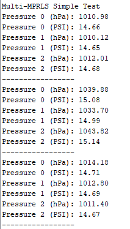

# Sample Pressure Sensor Code for SR12.5
Tested to work on Arduino AVR. Testing on the RP2040 has not been complete yet, however. I2C issues arose with a Raspberry Pi Pico.

## Quick Links
[TCA9548A I2C Expander Example Code](https://learn.adafruit.com/adafruit-tca9548a-1-to-8-i2c-multiplexer-breakout/wiring-and-test) 
[MPRLS Pressure Sensor Library Documentation](https://adafruit.github.io/Adafruit_MPRLS/html/class_adafruit___m_p_r_l_s.html#ad6b5aec331fb74927a7a3e36db0dfcbe) 
[MRPLS Pressure Sensor Library Source Code](https://github.com/adafruit/Adafruit_MPRLS) 

## Sample Output

 
